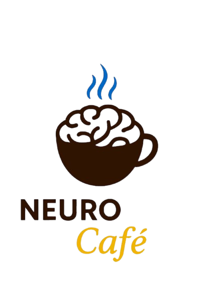

<p align="center">
  
</p>

<h1 align="center">☕ Neuro Cafe Summer School</h1>

<p align="center">
Where minds Meet siences
</p>

---

# 🧠 Computational Neuroscience Summer School

If you are interested in understanding the brain through data, machine learning, and modern computational tools, this program is for you.

## 🧬 What You Will Learn

- 🧠 **Spike Train Analysis** (Neuronal Activity)
- ⚡ **EEG Signal Processing**
- 🧿 **fMRI Brain Mapping**
- 📊 **Neural Decoding** (Machine Learning for Brain Data)
- 🧠🔗 **Brain Connectivity & Network Analysis**
- 📐 **Representational Similarity Analysis (RSA)**
- 🤖 **Deep Learning for Neural Data**
- 🧠🚀 **NeuroAI** (Brain-Inspired Artificial Intelligence)

---

## 💻 Hands-on Experience

- 🐍 Python-Based Analysis
- 📦 Real Neural Datasets
- 📈 Scientific Visualization
- 🧪 Research-Oriented Workflows

---

## 🎯 Perfect For

- 👨‍🎓 Neuroscience Students
- 👩‍💻 Computer Science & AI Students
- ⚡ Biomedical Engineering Students
- 📊 Data Science Enthusiasts
- 🧠 Anyone Curious About the Brain

---

## 🌍 Learning Journey

```text
🧠 Neural Signals
        ↓
📊 Data Analysis
        ↓
🧠 Cognitive Modeling
        ↓
🤖 Artificial Intelligence
